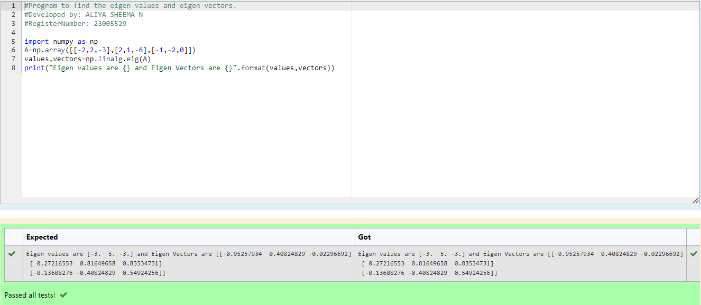

# EIGENVALUES-AND-EIGENVECTORS
NAME : ALIYA SHEEMA

REFERENCE NUMBER : 23005529

DEPARTMENT : AIDS
## AIM :
To write a python program to find the Eigenvalues and Eigen Vectors
## EQUIPEMENT'S REQUIRED :
1. 	Hardware – PCs
2. 	Anaconda – Python 3.7 Installation / Moodle-Code Runner
## ALGORITHM :
### Step 1 : 
Import the numpy module to use the built-in function for calculation.
### Step 2 : 
Prepare the lists from linear equation and assign in np.array().
### Step 3 : 
Using the np.linalg.eig(),  we get two results (first is eigenvalue and second is eigenvector) of the given matrix.
### Step 4 : 
End the Program.

## PROGRAM :
```
#Program to find the eigen values and eigen vectors.
#Developed by: ALIYA SHEEMA 
#RegisterNumber: 23005529

import numpy as np
A=np.array([[-2,2,-3],[2,1,-6],[-1,-2,0]])
values,vectors=np.linalg.eig(A)
print("Eigen values are {} and Eigen Vectors are {}".format(values,vectors))
```
## OUTPUT :

Python program to find the Eigenvalues and Eigen Vectors.



## RESULT :

Thus the Eigenvalue and Eigenvector is successfully solved using python program.
